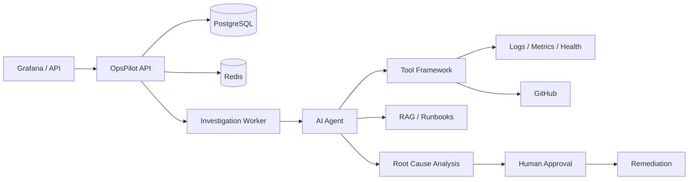

# OpsPilot

**AI-powered autonomous production incident response platform.**

OpsPilot receives production alerts, investigates incidents using AI agents and observability tools, determines probable root causes, and coordinates human-approved remediation — with a full audit trail.

> **Status:** Phases 7–10 complete. Human approval, React dashboard, OpenTelemetry hooks, and hardening (API key / rate limits / webhook HMAC / CI) are in place.

## Project Overview

OpsPilot is designed for SRE and platform engineering teams who need:

- Autonomous incident triage and investigation
- Evidence-based root cause analysis (not chatbot responses)
- Human-in-the-loop approval for high-risk actions
- Full auditability of agent and tool executions

## Architecture



## Phase 1 — Foundation

### Implemented

| Component | Description |
|-----------|-------------|
| Go HTTP server | Chi router, graceful shutdown, structured JSON logging |
| Configuration | Environment-based config with validation |
| PostgreSQL | Incident and incident_events tables via golang-migrate |
| Redis | Connection pool with health checks |
| Incident API | Create, list, get, timeline endpoints |
| State machine | Incident lifecycle with validated transitions |
| Health checks | `/api/v1/health`, `/api/v1/health/live` |
| Metrics | `/api/v1/metrics` (Prometheus) |
| Docker Compose | postgres, redis, migrate, opspilot-api |

## Phase 2 — Incident Engine

### Implemented

| Component | Description |
|-----------|-------------|
| Investigation model | `investigations` + `investigation_jobs` tables |
| Atomic intake | Single transaction for incident + investigation + job |
| Background worker | `cmd/worker` with `FOR UPDATE SKIP LOCKED` job claiming |
| Redis job notifications | LPUSH/BRPOP hint queue with DB polling fallback |
| Orchestrator | Coordinates incident creation and investigation enqueue |
| Investigation API | `GET /api/v1/incidents/{id}/investigation` |
| Optimistic locking | Status transitions use `WHERE status = expected` |
| Worker graceful shutdown | Waits for in-flight jobs before exit |

## Phase 3 — Tool Framework

### Implemented

| Component | Description |
|-----------|-------------|
| Tool interface | Generic `Tool` with `Execute`, `InputSchema`, permissions |
| Tool registry | Thread-safe registration and lookup |
| Tool executor | Timeouts, permission checks, audit persistence |
| Permission model | `READ_ONLY`, `REQUIRES_APPROVAL`, `AUTONOMOUS` |
| Mock tools | 13 tools across observability, DB, deployment, GitHub, knowledge, Slack |
| Worker integration | Investigation worker runs 5 read-only tools per incident |
| Tool API | `GET /api/v1/tools`, `POST /api/v1/incidents/{id}/tools/{name}/execute` |
| Evidence API | `GET /api/v1/incidents/{id}/evidence` (tool execution audit trail) |
| Persistence | `tool_executions` table with input/output/duration |

### Mock Tools

| Tool | Permission | Category |
|------|------------|----------|
| `search_logs` | READ_ONLY | Observability |
| `query_metrics` | READ_ONLY | Observability |
| `get_service_health` | READ_ONLY | Observability |
| `query_database` | READ_ONLY | Database |
| `get_database_connections` | READ_ONLY | Database |
| `get_recent_deployments` | READ_ONLY | Deployment |
| `search_github_commits` | READ_ONLY | GitHub |
| `inspect_code` | READ_ONLY | GitHub |
| `create_github_issue` | REQUIRES_APPROVAL | GitHub |
| `create_pull_request` | REQUIRES_APPROVAL | GitHub |
| `search_runbooks` | READ_ONLY | Knowledge (RAG-backed in Phase 5) |
| `search_previous_incidents` | READ_ONLY | Knowledge (RAG-backed in Phase 5) |
| `send_slack_notification` | AUTONOMOUS | Communication |

## Phase 4 — AI Agent

### Implemented

| Component | Description |
|-----------|-------------|
| LLM abstraction | Replaceable `llm.Provider` interface |
| Mock LLM | Deterministic evidence-based RCA (default, no API key) |
| OpenAI provider | OpenAI-compatible Chat Completions adapter |
| Investigation agent | Tool-calling loop + structured RCA validation |
| Short-term memory | Incident context, tool results, hypotheses |
| RCA persistence | `investigations.root_cause`, `confidence`, `reasoning_summary` |
| Agent runs | `agent_runs` audit table with tokens/duration/result |
| Worker integration | Tools → agent → `ROOT_CAUSE_IDENTIFIED` |
| Graceful degradation | LLM failure → `waiting_for_ai` without crashing worker |
| Agent API | `GET /api/v1/incidents/{id}/agent-runs` |

### AI Investigation Flow

```text
Incident job claimed
  → triage + collect evidence via tools
  → investigation agent (LLM)
       → optional follow-up READ_ONLY tool calls
       → structured RCA JSON (validated)
  → persist agent_run + RCA
  → incident → ROOT_CAUSE_IDENTIFIED
  → investigation → completed
```

### RCA Output Shape

```json
{
  "summary": "...",
  "root_cause": "...",
  "confidence": 0.91,
  "severity": "critical",
  "evidence": [{"id":"E-001","source":"logs","finding":"..."}],
  "rejected_hypotheses": [{"hypothesis":"...","reason":"..."}],
  "recommended_actions": ["..."],
  "reasoning_summary": "..."
}
```

## Phase 5 — RAG

### Implemented

| Component | Description |
|-----------|-------------|
| pgvector schema | `documents` + `document_chunks` (384-d) + HNSW index |
| Chunking | Overlapping text splitter (`RAG_CHUNK_SIZE` / overlap) |
| Mock embedder | Deterministic local embeddings (default) |
| OpenAI embedder | Compatible `/embeddings` with `dimensions=384` |
| Ingest service | Chunk → embed → store; directory seeder |
| Knowledge tools | RAG-backed `search_runbooks` / `search_previous_incidents` |
| Document API | CRUD-ish ingest/list/get/delete |
| Search API | `POST /api/v1/rag/search` for operators/debug |
| Seed corpus | `data/knowledge/*.md` auto-loaded on API start |
| CLI | `cmd/ingest` for manual/batch seeding |

### RAG Flow

```text
Seed / POST /documents
  → chunk + embed
  → PostgreSQL (pgvector)
Investigation job
  → search_runbooks (semantic)
  → (agent may call search_previous_incidents)
  → evidence included in RCA prompt
```

Design details for later work: [`docs/architecture/rag.md`](docs/architecture/rag.md).

## Phase 6 — Integrations

### Implemented

| Component | Description |
|-----------|-------------|
| Adapter layer | `internal/integrations/{loki,prometheus,grafana,github,slack}` |
| Provider switches | `*_PROVIDER=mock` (default) or real HTTP clients |
| Tool wrappers | Same tool names/schemas; results include `provider` |
| Grafana webhook | `POST /api/v1/webhooks/grafana` → incident intake |
| Status API | `GET /api/v1/integrations` |
| GitHub writes | Gated by approval + `GITHUB_WRITE_ENABLED` |

### Integration → Tool map

| System | Tools | Default |
|--------|-------|---------|
| Loki | `search_logs` | mock |
| Prometheus | `query_metrics` | mock |
| Grafana | `get_service_health` + alert webhook | mock |
| GitHub | commits, inspect, issue, PR | mock |
| Slack | `send_slack_notification` | mock |

Design details: [`docs/architecture/integrations.md`](docs/architecture/integrations.md).

## Phase 7 — Human Approval

### Implemented

| Component | Description |
|-----------|-------------|
| Remediation proposals | Auto-created from RCA recommended actions |
| Approvals audit | `approvals` table with actor/comment |
| APIs | list/propose/approve/reject + awaiting queue |
| Execution | Approved tools run (`create_github_issue`, Slack) |
| Lifecycle | → `WAITING_FOR_APPROVAL` → approve → `RESOLVED` |

See [`docs/architecture/approvals.md`](docs/architecture/approvals.md).

## Phase 8 — Dashboard

React + Vite app in [`web/`](web/):

- Incident list / detail (timeline, evidence, RCA)
- Approval queue + approve/reject
- Knowledge (RAG) search + integrations status
- Compose service `opspilot-web` on `:8088`

```bash
cd web && npm install && npm run dev   # http://localhost:5173
# or
docker compose up opspilot-web
```

## Phase 9 — Observability

- `OTEL_EXPORTER_OTLP_ENDPOINT` enables OTLP HTTP tracing (no-op when unset)
- Sample collector config: `deploy/otel/collector.yaml`
- Dashboard stub: `deploy/grafana/opspilot-overview.json`
- Docs: [`docs/architecture/observability.md`](docs/architecture/observability.md)

## Phase 10 — Hardening

- Optional `API_KEY` (`X-API-Key` / Bearer)
- Rate limits on create + Grafana webhook
- Optional `GRAFANA_WEBHOOK_SECRET` HMAC
- CORS via `CORS_ORIGINS`
- CI: `.github/workflows/ci.yml`
- Docs: [`docs/architecture/hardening.md`](docs/architecture/hardening.md)

### Directory Structure

```
production-incident-investigator/
├── cmd/{server,worker,ingest}
├── web/                     # Phase 8 React dashboard
├── data/knowledge/
├── docs/architecture/       # RAG, integrations, approvals, otel, hardening
├── deploy/{otel,grafana}
├── internal/...
├── migrations/              # through 000006
├── .github/workflows/ci.yml
├── docker-compose.yml
└── .env.example
```

## Tech Stack

- **Go 1.23** with modules
- **Chi** HTTP router
- **pgx** PostgreSQL driver
- **pgvector** vector similarity search
- **go-redis** Redis client
- **Prometheus** metrics endpoint
- **golang-migrate** database migrations
- **slog** structured JSON logging

## Database Schema (Phase 1)

### `incidents`

| Column | Type | Description |
|--------|------|-------------|
| id | UUID | Primary key |
| title | TEXT | Incident title |
| description | TEXT | Detailed description |
| severity | TEXT | critical, high, medium, low |
| service | TEXT | Affected service |
| environment | TEXT | production, staging, etc. |
| alert_source | TEXT | grafana, api, demo |
| status | TEXT | Lifecycle state |
| created_at | TIMESTAMPTZ | Creation time |
| updated_at | TIMESTAMPTZ | Last update |

### `incident_events`

| Column | Type | Description |
|--------|------|-------------|
| id | UUID | Primary key |
| incident_id | UUID | FK to incidents |
| event_type | TEXT | e.g. incident.created |
| from_status | TEXT | Previous status (nullable) |
| to_status | TEXT | New status (nullable) |
| message | TEXT | Human-readable message |
| metadata | JSONB | Additional context |
| created_at | TIMESTAMPTZ | Event time |

## Incident Lifecycle

```
RECEIVED → TRIAGING → INVESTIGATING → ROOT_CAUSE_IDENTIFIED
    → REMEDIATION_PROPOSED → WAITING_FOR_APPROVAL → REMEDIATION_EXECUTED → RESOLVED

Also: FAILED, CANCELLED, ESCALATED
```

Invalid transitions are rejected by the domain layer.

## API

### Create Incident

```bash
curl -X POST http://localhost:8080/api/v1/incidents \
  -H "Content-Type: application/json" \
  -d '{
    "title": "API latency increased",
    "severity": "critical",
    "service": "payment-service",
    "environment": "production",
    "description": "P95 latency increased above 3 seconds",
    "alert_source": "grafana"
  }'
```

Returns `202 Accepted` with the created incident.

### List Incidents

```bash
curl "http://localhost:8080/api/v1/incidents?status=RECEIVED&limit=20"
```

### Get Incident

```bash
curl http://localhost:8080/api/v1/incidents/{id}
```

### Incident Timeline

```bash
curl http://localhost:8080/api/v1/incidents/{id}/timeline
```

### List Tools

```bash
curl http://localhost:8080/api/v1/tools
```

### Execute Tool (incident context)

```bash
# Read-only tool (runs immediately)
curl -X POST http://localhost:8080/api/v1/incidents/{id}/tools/search_logs/execute \
  -H "Content-Type: application/json" \
  -d '{}'

# Approval-required tool (blocked without approved=true)
curl -X POST http://localhost:8080/api/v1/incidents/{id}/tools/create_github_issue/execute \
  -H "Content-Type: application/json" \
  -d '{"input":{"title":"Follow-up","body":"details"},"approved":true}'
```

### Get Evidence (tool executions)

```bash
curl http://localhost:8080/api/v1/incidents/{id}/evidence
```

### Get Investigation (includes RCA)

```bash
curl http://localhost:8080/api/v1/incidents/{id}/investigation
```

### Get Agent Runs

```bash
curl http://localhost:8080/api/v1/incidents/{id}/agent-runs
```

### List / Ingest Knowledge Documents (RAG)

```bash
curl http://localhost:8080/api/v1/documents

curl -X POST http://localhost:8080/api/v1/documents \
  -H "Content-Type: application/json" \
  -d '{
    "source_type": "runbook",
    "title": "Custom Runbook",
    "content": "Steps to mitigate connection pool exhaustion..."
  }'
```

### Semantic Search (RAG)

```bash
curl -X POST http://localhost:8080/api/v1/rag/search \
  -H "Content-Type: application/json" \
  -d '{"query":"database connection pool","top_k":5,"source_types":["runbook"]}'
```

### Integrations status

```bash
curl http://localhost:8080/api/v1/integrations
```

### Grafana alert webhook

```bash
curl -X POST http://localhost:8080/api/v1/webhooks/grafana \
  -H "Content-Type: application/json" \
  -d '{
    "title": "HighLatency",
    "status": "firing",
    "commonLabels": {
      "alertname": "HighLatency",
      "service": "payment-service",
      "environment": "production",
      "severity": "critical"
    },
    "alerts": [{"annotations": {"summary": "P95 latency above 3s"}}]
  }'
```

### Remediations (Phase 7)

```bash
curl http://localhost:8080/api/v1/remediations/awaiting
curl http://localhost:8080/api/v1/incidents/{id}/remediations
curl -X POST http://localhost:8080/api/v1/incidents/{id}/remediations/{proposalId}/approve \
  -H "Content-Type: application/json" \
  -d '{"actor":"oncall","comment":"ship it"}'
```

### Health

```bash
curl http://localhost:8080/api/v1/health
curl http://localhost:8080/api/v1/health/live
```

### Response Format

```json
{
  "success": true,
  "data": {},
  "error": null
}
```

## Local Setup

### Prerequisites

- Go 1.23+
- Docker and Docker Compose

### Quick Start (Docker)

```bash
cp .env.example .env
# Phase 5 needs pgvector. If upgrading from older postgres image:
# docker compose down -v
docker compose up --build
```

API available at `http://localhost:8080`. Seed runbooks load automatically when the knowledge base is empty.

### Seed / re-ingest knowledge

```bash
go run ./cmd/ingest -dir data/knowledge
go run ./cmd/ingest -dir data/knowledge -force   # re-ingest even if docs exist
```

### Local Development (without Docker for API)

```bash
# Start dependencies (pgvector image)
docker compose up postgres redis migrate -d

# Run API
cp .env.example .env
go run ./cmd/server
```

### Run Migrations Manually

```bash
migrate -path migrations -database "$DATABASE_URL" up
```

## Environment Variables

See [`.env.example`](.env.example) for all variables.

| Variable | Required | Description |
|----------|----------|-------------|
| DATABASE_URL | Yes | PostgreSQL connection string (pgvector required for RAG) |
| REDIS_URL | Yes | Redis connection string |
| HTTP_PORT | No | Default: 8080 |
| APP_ENV | No | Default: development |
| LOG_LEVEL | No | debug, info, warn, error |
| LLM_PROVIDER | No | `mock` (default) or `openai` |
| LLM_MODEL | No | Model name / mock model id |
| LLM_API_KEY | For openai | API key for OpenAI-compatible providers |
| LLM_BASE_URL | No | Default: `https://api.openai.com/v1` |
| LLM_TIMEOUT | No | Default: 60s |
| RAG_ENABLED | No | Default: true |
| RAG_TOP_K | No | Default: 5 |
| RAG_MIN_SCORE | No | Default: 0 (no filter) |
| RAG_CHUNK_SIZE | No | Default: 800 chars |
| RAG_CHUNK_OVERLAP | No | Default: 120 chars |
| RAG_SEED_ON_START | No | Default: true (API seeds empty KB) |
| RAG_SEED_DIR | No | Default: `data/knowledge` |
| EMBEDDING_PROVIDER | No | `mock` (default) or `openai` |
| EMBEDDING_MODEL | No | Default mock id / `text-embedding-3-small` |
| EMBEDDING_API_KEY | For openai | Falls back to `LLM_API_KEY` |
| EMBEDDING_BASE_URL | No | Defaults to `LLM_BASE_URL` |
| EMBEDDING_TIMEOUT | No | Default: 60s |
| LOKI_PROVIDER | No | `mock` (default) or `loki` |
| LOKI_URL | For loki | Loki base URL |
| PROMETHEUS_PROVIDER | No | `mock` (default) or `prometheus` |
| PROMETHEUS_URL | For prometheus | Prometheus base URL |
| GRAFANA_PROVIDER | No | `mock` (default) or `grafana` |
| GRAFANA_URL | For grafana | Grafana base URL |
| GITHUB_PROVIDER | No | `mock` (default) or `github` |
| GITHUB_TOKEN | For github | PAT / token |
| GITHUB_REPOSITORY | For github | `owner/repo` |
| GITHUB_WRITE_ENABLED | No | Default: false (issues/PRs) |
| SLACK_PROVIDER | No | `mock` (default) or `slack` |
| SLACK_BOT_TOKEN | For slack | Bot token |
| SLACK_DEFAULT_CHANNEL | No | Default: `#incidents` |
| INTEGRATION_TIMEOUT | No | Default: 15s |
| PUBLIC_URL | No | Links in Slack notifies (default localhost:8080) |
| OTEL_EXPORTER_OTLP_ENDPOINT | No | Empty disables tracing |
| OTEL_SERVICE_NAME | No | Default: opspilot |
| API_KEY | No | When set, required on API (except health/metrics) |
| CORS_ORIGINS | No | CSV of allowed origins |
| GRAFANA_WEBHOOK_SECRET | No | HMAC secret for Grafana webhooks |
| RATE_LIMIT_PER_MINUTE | No | Default: 120 |

## Testing

```bash
gofmt -w .
go test ./...
go vet ./...

# Integration tests (requires docker compose up)
go test -tags=integration ./tests/integration/... -v
```

## Roadmap

| Phase | Status | Scope |
|-------|--------|-------|
| 1 — Foundation | ✅ Complete | HTTP, PostgreSQL, Redis, incident API |
| 2 — Incident Engine | ✅ Complete | Worker, job queue, investigation model |
| 3 — Tool Framework | ✅ Complete | Tool registry, permissions, mocks, evidence API |
| 4 — AI Agent | ✅ Complete | LLM abstraction, investigation agent, structured RCA |
| 5 — RAG | ✅ Complete | Document ingestion, pgvector, RAG knowledge tools |
| 6 — Integrations | ✅ Complete | GitHub, Slack, Grafana, Prometheus, Loki adapters |
| 7 — Human Approval | ✅ Complete | Remediation proposals, approve/reject, execution |
| 8 — Dashboard | ✅ Complete | React operator UI (`web/`) |
| 9 — Observability | ✅ Complete | OTel OTLP hooks + sample dashboards |
| 10 — Hardening | ✅ Complete | API key, rate limits, webhook HMAC, CI |

## License

MIT
