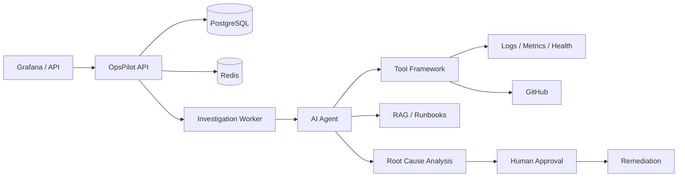

# OpsPilot

**AI-powered autonomous production incident response platform.**

OpsPilot receives production alerts, investigates incidents using AI agents and observability tools, determines probable root causes, and coordinates human-approved remediation — with a full audit trail.

> **Status:** Phase 2 (Incident Engine) complete. Async investigation worker, job queue, and atomic intake are operational.

## Project Overview

OpsPilot is designed for SRE and platform engineering teams who need:

- Autonomous incident triage and investigation
- Evidence-based root cause analysis (not chatbot responses)
- Human-in-the-loop approval for high-risk actions
- Full auditability of agent and tool executions

## Architecture



## Phase 1 — Foundation

### Implemented

| Component | Description |
|-----------|-------------|
| Go HTTP server | Chi router, graceful shutdown, structured JSON logging |
| Configuration | Environment-based config with validation |
| PostgreSQL | Incident and incident_events tables via golang-migrate |
| Redis | Connection pool with health checks |
| Incident API | Create, list, get, timeline endpoints |
| State machine | Incident lifecycle with validated transitions |
| Health checks | `/api/v1/health`, `/api/v1/health/live` |
| Metrics | `/api/v1/metrics` (Prometheus) |
| Docker Compose | postgres, redis, migrate, opspilot-api |

## Phase 2 — Incident Engine (Current)

### Implemented

| Component | Description |
|-----------|-------------|
| Investigation model | `investigations` + `investigation_jobs` tables |
| Atomic intake | Single transaction for incident + investigation + job |
| Background worker | `cmd/worker` with `FOR UPDATE SKIP LOCKED` job claiming |
| Redis job notifications | LPUSH/BRPOP hint queue with DB polling fallback |
| Orchestrator | Coordinates incident creation and investigation enqueue |
| Investigation API | `GET /api/v1/incidents/{id}/investigation` |
| Optimistic locking | Status transitions use `WHERE status = expected` |
| Worker graceful shutdown | Waits for in-flight jobs before exit |

### Directory Structure

```
production-incident-investigator/
├── cmd/
│   ├── server/              # API entrypoint
│   └── worker/              # Investigation worker
├── internal/
│   ├── config/              # Environment configuration
│   ├── domain/
│   │   ├── incident/        # Incident models, state machine
│   │   └── investigation/   # Investigation and job models
│   ├── application/
│   │   ├── incident/        # Incident business logic
│   │   └── investigation/   # Orchestrator, processor, intake
│   ├── infrastructure/
│   │   ├── postgres/        # PostgreSQL repositories
│   │   └── redis/           # Redis client and job queue
│   ├── transport/http/      # HTTP server, router, middleware
│   └── pkg/logger/          # Structured logging
├── migrations/              # SQL migrations
├── docker-compose.yml
├── Dockerfile
└── .env.example
```

## Tech Stack

- **Go 1.23** with modules
- **Chi** HTTP router
- **pgx** PostgreSQL driver
- **go-redis** Redis client
- **Prometheus** metrics endpoint
- **golang-migrate** database migrations
- **slog** structured JSON logging

## Database Schema (Phase 1)

### `incidents`

| Column | Type | Description |
|--------|------|-------------|
| id | UUID | Primary key |
| title | TEXT | Incident title |
| description | TEXT | Detailed description |
| severity | TEXT | critical, high, medium, low |
| service | TEXT | Affected service |
| environment | TEXT | production, staging, etc. |
| alert_source | TEXT | grafana, api, demo |
| status | TEXT | Lifecycle state |
| created_at | TIMESTAMPTZ | Creation time |
| updated_at | TIMESTAMPTZ | Last update |

### `incident_events`

| Column | Type | Description |
|--------|------|-------------|
| id | UUID | Primary key |
| incident_id | UUID | FK to incidents |
| event_type | TEXT | e.g. incident.created |
| from_status | TEXT | Previous status (nullable) |
| to_status | TEXT | New status (nullable) |
| message | TEXT | Human-readable message |
| metadata | JSONB | Additional context |
| created_at | TIMESTAMPTZ | Event time |

## Incident Lifecycle

```
RECEIVED → TRIAGING → INVESTIGATING → ROOT_CAUSE_IDENTIFIED
    → REMEDIATION_PROPOSED → WAITING_FOR_APPROVAL → REMEDIATION_EXECUTED → RESOLVED

Also: FAILED, CANCELLED, ESCALATED
```

Invalid transitions are rejected by the domain layer.

## API

### Create Incident

```bash
curl -X POST http://localhost:8080/api/v1/incidents \
  -H "Content-Type: application/json" \
  -d '{
    "title": "API latency increased",
    "severity": "critical",
    "service": "payment-service",
    "environment": "production",
    "description": "P95 latency increased above 3 seconds",
    "alert_source": "grafana"
  }'
```

Returns `202 Accepted` with the created incident.

### List Incidents

```bash
curl "http://localhost:8080/api/v1/incidents?status=RECEIVED&limit=20"
```

### Get Incident

```bash
curl http://localhost:8080/api/v1/incidents/{id}
```

### Incident Timeline

```bash
curl http://localhost:8080/api/v1/incidents/{id}/timeline
```

### Health

```bash
curl http://localhost:8080/api/v1/health
curl http://localhost:8080/api/v1/health/live
```

### Response Format

```json
{
  "success": true,
  "data": {},
  "error": null
}
```

## Local Setup

### Prerequisites

- Go 1.23+
- Docker and Docker Compose

### Quick Start (Docker)

```bash
cp .env.example .env
docker compose up --build
```

API available at `http://localhost:8080`.

### Local Development (without Docker for API)

```bash
# Start dependencies
docker compose up postgres redis migrate -d

# Run API
cp .env.example .env
go run ./cmd/server
```

### Run Migrations Manually

```bash
migrate -path migrations -database "$DATABASE_URL" up
```

## Environment Variables

See [`.env.example`](.env.example) for all variables.

| Variable | Required | Description |
|----------|----------|-------------|
| DATABASE_URL | Yes | PostgreSQL connection string |
| REDIS_URL | Yes | Redis connection string |
| HTTP_PORT | No | Default: 8080 |
| APP_ENV | No | Default: development |
| LOG_LEVEL | No | debug, info, warn, error |

## Testing

```bash
gofmt -w .
go test ./...
go vet ./...
```

## Roadmap

| Phase | Status | Scope |
|-------|--------|-------|
| 1 — Foundation | ✅ Complete | HTTP, PostgreSQL, Redis, incident API |
| 2 — Incident Engine | ✅ Complete | Worker, job queue, investigation model |
| 3 — Tool Framework | Planned | Tool registry, permissions, mocks |
| 4 — AI Agent | Planned | LLM abstraction, orchestration, memory |
| 5 — RAG | Planned | Document ingestion, pgvector |
| 6 — Integrations | Planned | GitHub, Slack, Grafana, Prometheus, Loki |
| 7 — Human Approval | Planned | Approval workflow, action execution |
| 8 — Dashboard | Planned | React frontend |
| 9 — Observability | Planned | OpenTelemetry, Grafana dashboards |
| 10 — Hardening | Planned | Auth, rate limiting, integration tests |

## License

MIT
